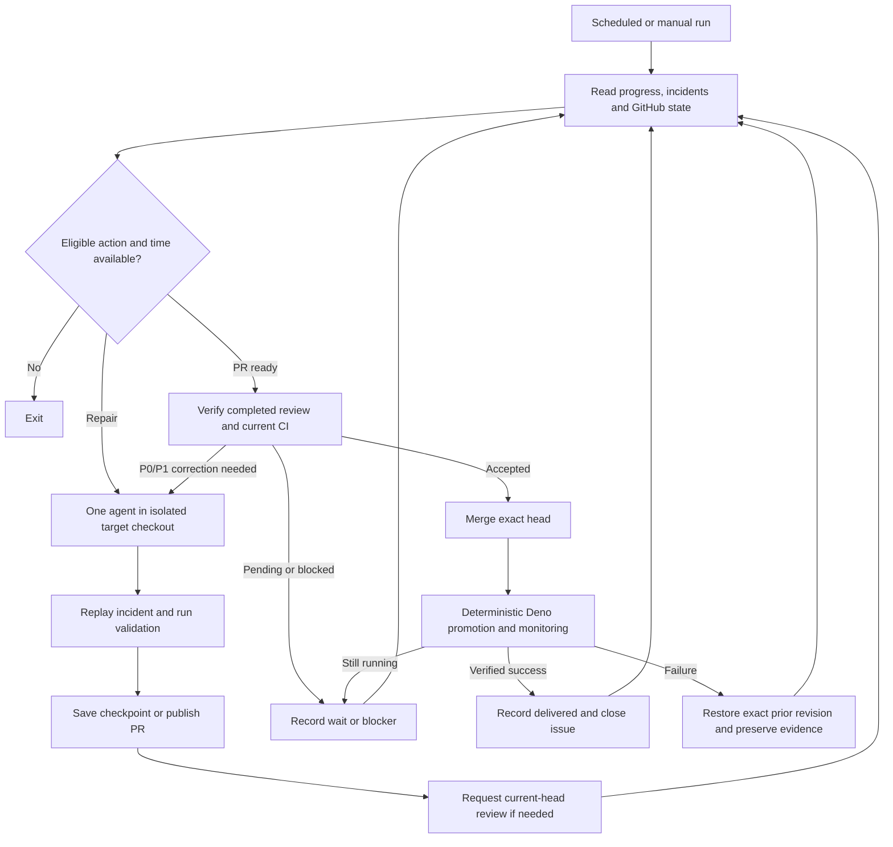

> Historical design rationale copied from the planning discussion. MASTER-PLAN.md is authoritative for this new repository, module ownership and review timing. No old repository lane is reused.

# Standalone Sentinel: minimal polling design

Revised 2026-09-06 in response to the owner's request for dramatic simplification. This replaces the earlier event-driven, multi-worker draft at this path. Planning only: no repository, workflow, credential, or production setting was changed. The existing ai.ubq.fi repair lane remains separate.

## Decision

Build one scheduled repair workflow with one implementation writer across all configured repositories, plus one small deterministic release workflow for promotion and rollback. The job polls current evidence, selects the next eligible action, checks the shared model budget if needed, performs it, and records progress. Several PRs may wait for review, but only one code-changing action runs at a time.

No webhook receiver, event bus, worker dispatcher, matrix, agent fleet, separate queue service, or autonomous Sentinel self-modification in version one. No agent is needed to orchestrate the lifecycle: ordinary TypeScript code does that. Use the implementation model only for diagnosis, planning and code correction within the selected task. Preserve the configured runtime model policy.

The business outcome remains: retrieve a real failing request, reproduce its failure, fix it, obtain Codex review acceptance, merge and verify delivery, then continue to the next issue. Review is asynchronous; merge is blocked until a verified completed review of the current head has no unresolved P0/P1 findings.

## What was removed and why

| Previous design | Simpler replacement |
| --- | --- |
| Webhooks plus polling fallback | Polling is the sole discovery mechanism |
| Always-available ingress and event delivery retries | No ingress service or webhook subscriptions |
| Master coordinator dispatching worker jobs | One job calls the selected implementation agent directly |
| Matrix expansion, capacity allocation and helper agents | One writer; no parallel agent execution |
| Separate transactional queue database | Small Git-backed progress records in the Sentinel repository |
| Distributed leases, writer epochs and path reservations | One non-cancelling workflow concurrency group; verify prior run has stopped before takeover |
| Multiple queues and fault circuits | One deterministic action ordering with per-item retry limits |
| Custom review-acceptance check publisher | Direct trusted review verification immediately before merge, plus existing target branch protections |
| Generic multi-provider deployment orchestration | One explicit Deno release adapter with deterministic promotion and rollback |
| Autonomous controller repair | Maintainer updates Sentinel through its own normal PR process |

These are deletions from version one, not disabled alternative paths to maintain. Add concurrency only after serial delivery is demonstrably insufficient.

## One loop

Proposed cadence: every 15 minutes, at an offset such as minutes 7, 22, 37 and 52. A manual run may invoke the same workflow, never a separate execution path. No PR, review, push or incident event triggers Sentinel. Disable automatic duplicate review requests for Sentinel-owned PRs if they would overlap with its explicit request mechanism; resolve the target's setup during onboarding.

Use one fixed GitHub Actions concurrency group for the repair loop with cancellation of active runs disabled. New scheduled runs can wait or be superseded; they carry no unique work. Every actual run rereads the current authoritative sources. There is no promise that every cron tick executes or that discovery is immediate.

At the start and after each completed action:

1. Read saved records and current target GitHub state. Reconcile incomplete publication or delivery first.
2. Poll each configured application's unresolved incident list and GitHub issues/PRs/reviews/checks.
3. Derive eligible actions, excluding pending reviews, active target releases, future retry times, unavailable model budget and explicit blockers.
4. Choose the highest-priority eligible action and execute it serially.
5. Save its progress. Repeat while useful work and time remain; otherwise exit. Budget exhaustion skips model work but still permits safe deterministic review collection and delivery observation.

Never sleep for a review inside the job. A pending PR is skipped, so the same job can begin another task. If all work is waiting, exit and let the next scheduled run check again. Polling errors leave the affected source unchanged and unavailable for this pass; they do not turn missing evidence into success or prevent safe work in another repository.

Avoid a busy loop: each pass marks unchanged waiting/failed observations as considered. Reread after meaningful work, not repeatedly because the previous API response was pending. When no eligible action remains, exit.

## Priority in plain terms

First reconcile a previously started merge/release and complete any ready delivery bookkeeping. Do not start another release to the same target while its current release is unresolved. Among code-changing actions:

1. Confirmed active production incidents, severity then oldest first_seen.
2. P0/P1 corrections to Sentinel-owned PRs, P0 first.
3. Other reproducible unresolved 5xx incident groups, severity then oldest first_seen.
4. Other unfinished Sentinel-owned PR corrections, such as failed CI or conflicts.
5. GitHub issues and nonblocking review findings, highest recognized numeric Priority then oldest creation time, followed by repository and issue ID for stable ties.

A confirmed severe security/data-loss finding belongs in the incident class regardless of its source. Missing priority sorts last; duplicate recognized priorities use the highest. Preserve actual prerequisites, protected actions, source consistency and contributor ownership. Do not impose author, assignment, estimate, template or file-hint admission filters.

Repeated errors with the same incident identity increase its count/impact; they do not create more repair tasks. Link a discovered issue/incident to an existing Sentinel PR before creating another. Do not take over human-owned PRs without explicit delegation.

Start with at most three unfinished Sentinel PRs globally. This permits progress while reviews wait without accumulating ten branches and repeated base conflicts. Pending review consumes one of these three places, but no active agent. Corrections and delivery of existing PRs remain eligible at the cap. Sustained urgent incidents can starve lower-priority work; expose that queue age rather than invent a second fairness scheduler in version one.

## Minimal persistent state

GitHub already stores branches, PRs, reviews, checks and releases. The application already stores incidents and request evidence. Do not copy their complete histories into another queue database.

Keep a dedicated operational-state branch in the Sentinel repository, separate from its source branch. Use a small JSON record per work item, updated by the sole trusted workflow writer with a normal non-force push. A concurrent/ref mismatch stops the write and requires rereading; it never overwrites state. Source commits and state commits must not trigger extra runs. The coding agent has no credentials to change these records.

Record only what cannot be reliably inferred from the authoritative systems:

- Stable repository/source identity, source revision and linked incident/issue IDs.
- Target base, checkpoint branch/SHA, PR number and controller version used.
- Next step: work, review, delivery, blocked or done.
- Review request head/ID and correction-round count.
- Bounded implementation/infrastructure attempt counts, next retry time and blocker reason.
- Incomplete external operation: intended branch/PR/head or merge identity.
- References and hashes for retained evidence and verified delivery results.

Do not store payloads, raw prompts, private logs or secrets in these Git records. Keep them in authenticated restricted artifact storage. Keep completed compact records to prevent unchanged tasks restarting; do not introduce pruning until a demonstrated storage need has an explicit retention design.

A crash before/after a push, PR creation, review request or merge is handled by checking the exact remote identity on the next run before repeating it. Reserve deterministic branch/task identifiers and save intent before the external write. If a result cannot be established, mark that operation blocked rather than guessing or generating a duplicate. This is the minimum recovery logic external side effects require; deleting it would make the simpler design unreliable.

One repair workflow concurrency group removes the need for a distributed implementation lease system only while it is the sole code-writing executor. The release controller has its own serial group and exclusively owns promotion/rollback and release records; it never edits application code or the repair progress records. Do not allow local executions or a second deployment of Sentinel to perform target writes alongside it. A still-running old job must be verified stopped before resumption. Humans can still edit target repositories, so expected-head pushes, source rechecks and branch protections remain necessary.

## Review contract: one pending request, then poll

The trusted loop requests Codex review once for an exact PR head and saves the request identity. If interrupted, it inspects that PR's review requests/results before sending another. A pending review is waiting, not a failed implementation. A 30-minute wait never consumes a repair attempt or causes another request every cron.

To merge, verify all of these together:

- A completed review from the expected Codex identity bound to the current PR head.
- No unresolved P0/P1 findings. An agent resolving a thread does not establish acceptance by itself.
- Current required CI and target branch protections pass.
- The actual merge candidate remains valid against the current base.
- No unfinished target release or conflicting owner operation.

A request acknowledgement, eyes reaction, missing comments, elapsed time, or unrelated green check is not a clean verdict. Missing, malformed or unverifiable completion evidence leaves the PR waiting/blocked. Validate the actual clean and finding-bearing review outputs during onboarding; autonomous merge stays off until the adapter can prove this boundary.

A correction stays on the same PR, produces a new head, reruns validation and gets a new review. Up to three review rounds per work-item cycle; unresolved P0/P1 at the bound means blocked for owner action, never merge. Preserve counts across restarts. Lower-severity findings become future work unless target policy requires more. The coding agent cannot downgrade a blocking finding to grant itself merge permission.

Verify acceptance in the trusted merge function and submit the merge with the expected head SHA. Retain existing branch protections and required approvals without bypass. No custom GitHub check publisher is necessary to prevent Sentinel itself from merging prematurely; this does not claim to stop an independently authorized human from merging outside Sentinel. If organization-wide enforcement becomes a requirement, implement that separately.

When another PR changes the target base, rerun relevant integration validation. If rebase/correction changes the candidate head, request a fresh review. Preserve old review provenance; never relabel it as a review of new bytes.

## One shared model budget gate

Cron determines when work is checked. It is not a spending limit: one scheduled run can start many tasks, and one agent task can make many model requests. Keep deterministic checks separate from model admission.

Use one small budget record on the same operational-state branch, written by the same sole workflow writer. Before each independently started implementation/triage/correction session, automatic continuation or explicit Codex review request, reserve one start and durably push that reservation. If the reservation cannot be saved, do not invoke the model. Charge retries too. Do not treat internal model turns as separately observed if the selected client does not expose them.

The repository configuration contains two owner-set limits: maximum model-task starts in a rolling hour and maximum starts in a rolling seven-day window. Apply both across all configured target repositories, including manual runs of this workflow. They are local Sentinel admission limits, not claims about OpenAI's actual remaining allowance or reset time. Do not guess production values; set them before enabling autonomous inference. Existing per-task runtime/continuation limits and the three-PR cap remain in force.

Count review requests against the same conservative start allowance; do not give them an uncapped side channel. No automatic incident exception bypasses the cap. Queue urgency chooses which permitted task starts next. When limits are reached, save the earliest eligible retry time and leave work ready-but-budget-waiting; do not repeatedly launch the agent to discover the same limit. Deterministic polling, authenticated review ingestion and already-authorized safe delivery reconciliation remain allowed.

Reservations have a unique task/head/attempt identity, timestamp and outcome. Restart reuses the same reservation for reconciliation rather than charging or invoking again blindly. An ambiguous submission stays charged until proven never submitted. Failed or timed-out model tasks are not refunded automatically. Keep reservations for the full rolling window and active ambiguous operations; older compact totals can remain for audit. One writer avoids a separate distributed quota service.

This limits starts, not exact tokens or subscription consumption. A single agent session or hosted review can make multiple hidden requests. Retain bounded session duration and supported token/turn/output limits where the existing client exposes them; do not invent flags or claim a runtime deadline equals a token cap. Stop model admission on authoritative capacity exhaustion and report the provider signal. Manual Codex use outside Sentinel also consumes capacity that this record cannot measure, so leave owner-chosen headroom. A hard monetary/token ceiling would require provider-enforced limits or metered request accounting and is outside this minimal subscription-based design.

Deterministic events could be added later solely as an optional wake-up optimization, but version one remains polling-only. Even if wake-ups are later added, they must use this same budget gate and cannot directly invoke an agent. There is no event service to build now.

## Application evidence: two adapter operations initially

Start with the gateway and these read-only adapter operations:

- `listUnresolvedIncidents`: paginated stable incident IDs, severity, first_seen, last_seen, count and failing deployment identity.
- `readIncident`: bounded error context and authenticated request/upstream artifact references, with hashes and a reproduction description.

Poll unresolved incident groups rather than only the newest log lines. The application must retain each unresolved incident and its required evidence long enough for Sentinel to act; an error cannot disappear solely because no run occurred that hour. Exhaust pagination within a declared bound or report incomplete coverage; do not silently treat the first page as complete. This avoids a second event-ingestion service and a cursor/checkpoint protocol in Sentinel. An adapter backed by rotating logs must provide durable incident retention before unattended repair is enabled.

Use target repository configuration for checkout branch, validation/replay commands, protected paths and the existing release/acceptance workflow to observe. Keep this a small declarative configuration, not arbitrary model-generated commands. No generic plugin framework or arbitrary deployment engine is needed initially.

Reproduce the captured failure at its recorded application revision, then verify corrected behavior on the candidate. Capture enough request and upstream context to reproduce streaming/provider failures. Remove credentials; restrict sensitive evidence; replay against isolated dependencies to avoid duplicate paid or destructive actions. A proper 4xx for invalid input can satisfy the fix; hiding every 500 behind a 200 cannot.

App evidence stays app-owned. If its retention cannot cover an active repair, retain a bounded encrypted snapshot in the existing artifact mechanism and record its hash. Do not build a centralized logs platform inside Sentinel.

## Captured requests become permanent regression tests

Keep two different artifacts: the original incident evidence, encrypted with restricted access and retention, and a minimal deterministic regression fixture committed to the target repository alongside the fix. Do not commit the original user request wholesale. Remove credentials and personal content, reduce the input to the triggering behavior, and preserve necessary protocol details. Retain a provenance hash/incident ID without exposing the original contents.

Run the same test against the recorded failing revision and the candidate: it must fail for the intended reason before the fix and pass afterward. Expected status, response shape, stream termination and relevant invariants must be explicit. If the old failure cannot be reproduced, record that limitation and do not claim causal proof. When it depends on upstream output, record a sanitized upstream response fixture and replay it locally; do not repeatedly call the live paid provider.

Wire the resulting test into the target's normal CI suite, so future changes exercise it without incident-store access or model inference. Keep normal tests and the original acceptance contract; the agent must not weaken assertions or alter expected output just to make the candidate pass. A fixture requiring sensitive irreducible data stays in restricted test storage with a safe synthetic regression in the repository where possible; do not force private data into Git.

## Direct Deno promotion and rollback

The owner wants Sentinel to operate releases directly. Retain that capability through one small deterministic release controller, separate from the budgeted coding loop. It uses a concrete Deno adapter, not an LLM deciding which revision to promote. The target CI builds the exact merged commit and exposes the immutable candidate revision; Sentinel owns stable promotion and rollback. Onboarding must remove competing automatic promotion writers before enabling this mode. There must be exactly one release owner per target.

The release sequence is fixed:

1. Verify the exact accepted merged SHA, successful build and immutable candidate revision. Replay/probe the candidate before promotion.
2. Read and attest the actual healthy current revision and full SHA; persist these as the rollback target before any promotion.
3. Persist promotion intent, promote only the identified candidate through the existing Deno API, require HTTP 204, and verify exact managed stable identity in body and headers. Probe the custom domain with the existing Cloudflare 403 warning policy; an HTTP 200 identity mismatch fails.
4. Monitor for the target's defined acceptance window; for ai.ubq.fi retain 30 continuous minutes with 30-second sampling. The controller compares objective candidate telemetry with the pre-promotion baseline and absolute health requirements.
5. On an attributable acceptance failure, restore exactly the recorded previous immutable revision and prove its identity. Record both the original failure and any rollback failure. Never choose a revision by list order, timestamp or “latest”.
6. On success, publish the exact acceptance receipt. Only then does the repair loop mark the item delivered and close its issue. A closure failure retries closure, not implementation or promotion.

“Less stable” needs a deterministic target policy: relevant 5xx rate with request-count denominator, timeout/stream-failure rate, required health probes and deployment identity. Configure explicit thresholds, a comparison window and minimum sample count before enabling statistical rollback. Exclude expected 4xx and distinguish upstream-wide incidents from candidate defects. Low traffic or missing telemetry is insufficient evidence, not proof of stability. Hard identity/health failures can trigger immediate rollback under the existing target rules; noisy single samples do not justify arbitrary revision switching. Do not invent universal numeric thresholds in this design.

The release controller uses no LLM and never consumes the model-start budget. It may run while the repair loop waits or works on another repository. It has one serialized release job initially, its own release-state branch/records, and sole access to promotion credentials; the repair loop reads its receipts and cannot promote. This gives disjoint ownership without reintroducing a distributed queue or parallel coding writers. Application/model agents never receive the Deno token.

Run it as a bounded release workflow that persists progress before effects and polls during acceptance. Its five-minute scheduled entry point reads durable release requests and unfinished release records using the same serialized non-cancelling workflow. The repair loop writes a request; it does not dispatch a job or send an event. The release workflow polls that request, so the two workflows need no message-delivery protocol. A scheduled invocation that finds no work exits without inference. A terminated release job resumes by inspecting the actual stable revision and saved intent before acting; no second promotion is inferred from a missing receipt.

Do not claim uninterrupted protection from GitHub Actions: a lost runner or delayed recovery schedule creates a monitoring gap. Resume conservatively, restart the continuous acceptance window when observation coverage was lost, and retain independent application health alerting. If rollback requires a guaranteed short response time even during Actions outages, run this same small deterministic controller on an independently supervised host. That hosting requirement cannot be removed by simplifying code.

Continue post-acceptance checks through the existing scheduled deterministic controller if ongoing stability supervision is enabled, using the same owner-set thresholds and exact revision ownership. Once another authorized release changes production, the previous receipt cannot roll back that newer release. Before any rollback, verify that the failed candidate is still the controlled current revision. No automatic roll-forward after rollback and no oscillation between builds; leave the failed candidate blocked pending a new reviewed fix.

Do not automatically close an issue merely because GitHub merged the PR; avoid auto-closing keywords until verified delivery. A review or publication failure never restarts successful code generation unnecessarily.

## Sentinel self-improvement: preserve the option, defer recursion

Version one does not autonomously change Sentinel's controller or its permission/budget/review/rollback policy. The deterministic release controller is a small stable safety boundary, not a second AI supervisor. Repair agents cannot edit or redeploy it.

A later first step can let Sentinel propose a PR against its own repository with captured reproducer/tests, while a maintainer approves and activates it. Keep repair budget, credentials, review acceptance and release authority outside that candidate's write scope. Only after normal repair and rollback are reliable should we consider autonomous activation of controller changes behind a separately owner-approved immutable bootstrap. Do not implement recursive agents, a self-modifying bootstrap or automatic permission expansion in the initial slice.

## Runtime, reliability and explicit tradeoffs

Initial job ceiling: 120 minutes, below GitHub's six-hour hosted-job maximum. Respect the existing model invocation bounds. Stop starting a new action when its declared maximum plus checkpoint/publication margin does not fit. Save checkpoints during work and after validation; do not depend on a termination handler. A successful published candidate survives runner loss; unsaved work may need a bounded retry, which is reported honestly.

A 15-minute cadence is a polling target, not a response-time guarantee. A long current action can delay discovering an incident or completed review; GitHub can delay/drop schedules, too. The next run reads retained current state, so correctness does not depend on receiving a transient notification. Delayed execution can still delay repairs. Independent application alerting and the separate deterministic release controller continue; their documented host availability limits still apply.

Example: A requests review, then the same writer starts B. When B finishes, the loop polls A again. If no other useful work remains, it exits. A's completed review is picked up by a later scheduled run. There is no review event to deliver, miss, deduplicate or replay.

The owner chooses simpler execution over immediate response and horizontal throughput for version one. If near-instant triage becomes a hard requirement, this design needs a different execution host or extra capacity; it must not claim that polling eliminates all availability failures.

## First implementation slice and proof

Implement only one gateway adapter, one scheduled loop, shared model-start budget, target checkout/repair, progress records, Codex review polling, permanent regression fixtures, and the deterministic Deno release controller. Keep the Sentinel GitHub App for scoped short-lived cross-repository access, without webhook subscriptions. The App private key and Git write tokens remain with the trusted workflow, outside the coding agent. No infrastructure or credentials are provisioned in this planning revision.

Demonstrate:

1. A captured gateway failure becomes a reproducible test and bounded fix.
2. A published PR waits for review while the same writer advances a second task.
3. A later run retrieves the completed review, fixes P0/P1 if present, and merges only the accepted current head with passing CI.
4. The target builds the exact merged candidate; Sentinel promotes it, proves acceptance and closes the issue, and a deliberately failing candidate proves exact prior-revision rollback.
5. Killing a run after candidate publication does not regenerate completed work or duplicate the PR/review request.
6. Duplicate polling, unavailable review, changed head, exhausted review budget, state-push conflict and failed deployment all leave explicit safe states; release-job interruption and missing telemetry cannot fabricate acceptance or roll back an unrelated newer release.
7. Rolling-hour/seven-day limits hold across repositories and restarts; a reservation-push failure prevents invocation, retries consume budget, ambiguous submissions remain charged, and deterministic polling continues at the cap.

Do not add a dashboard, matrix workers, webhooks, a custom queue database, self-healing controller agents or generalized adapter framework to meet this milestone. Scale later based on measured delivery throughput and waiting time.

## Sources and scope

Sources checked earlier in this design session on 2026-09-06:

- https://docs.github.com/en/actions/reference/limits — hosted-job execution ceiling.
- https://docs.github.com/en/actions/using-workflows/events-that-trigger-workflows — scheduled workflows may be delayed or dropped.
- https://learn.chatgpt.com/docs/third-party/github — Codex review trigger and publication; acknowledgement is distinct from review.

The current owner requirement makes P0/P1 review acceptance a merge gate for this standalone design, unlike the old embedded prototype's asynchronous non-gating policy. This revision does not silently change the existing prototype or its handoff. No GPT Pro call was made. Deno promotion and health-identity contracts here come from the current repository AGENTS and the existing audited implementation; no new deployment API behavior is assumed.
